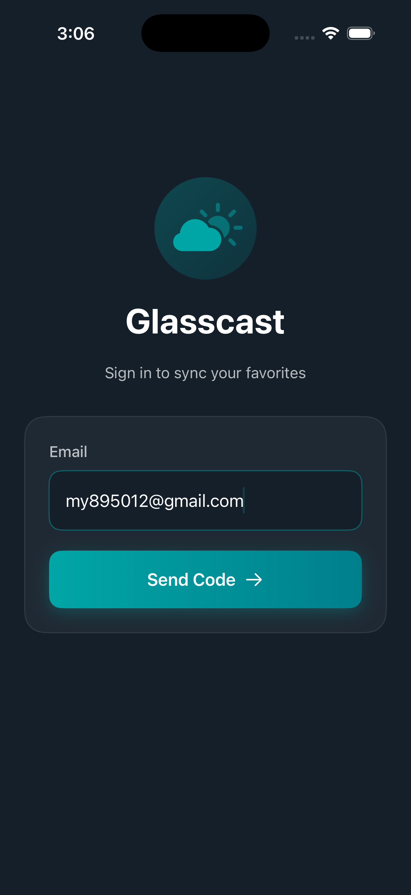
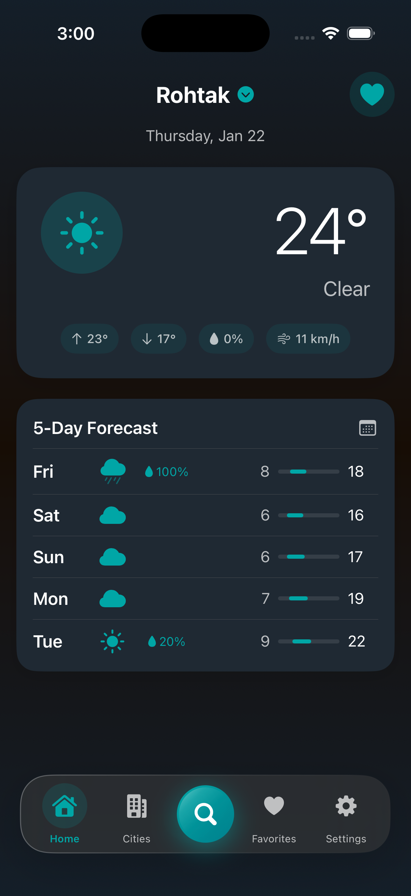
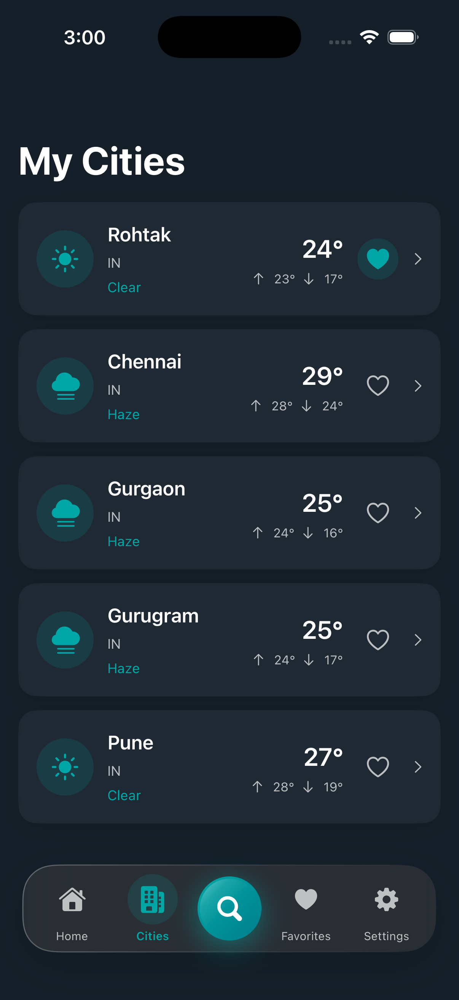
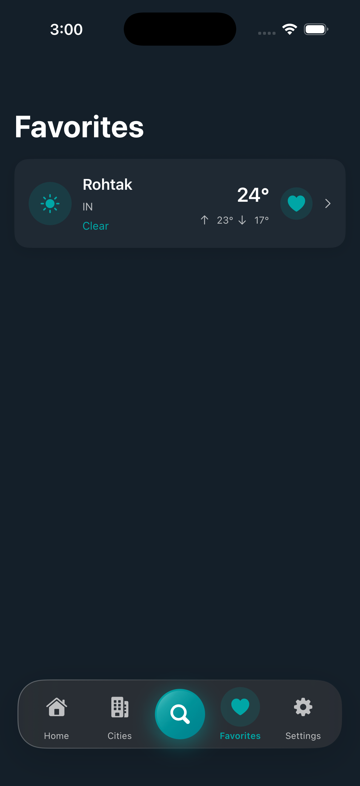
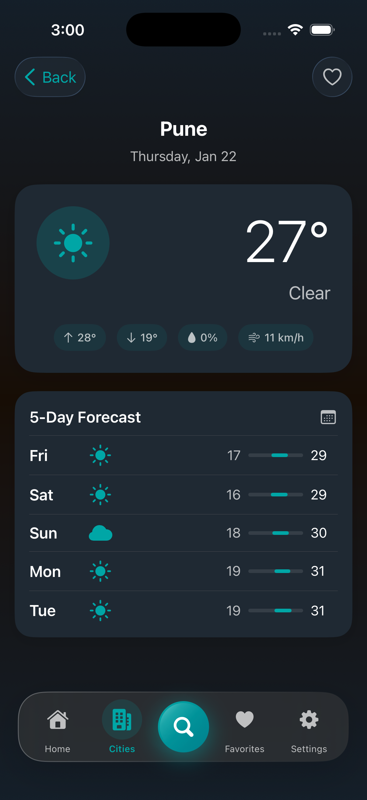
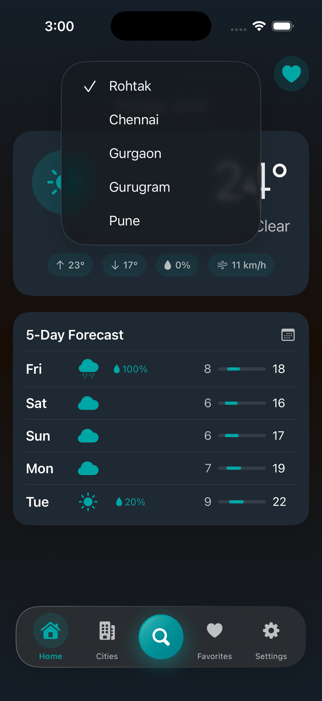
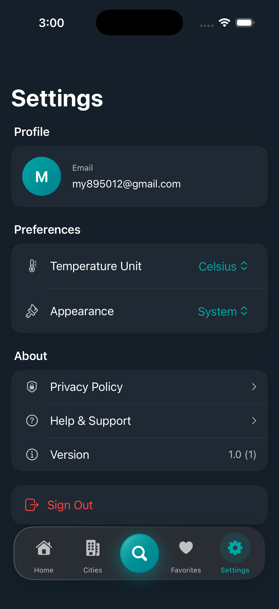
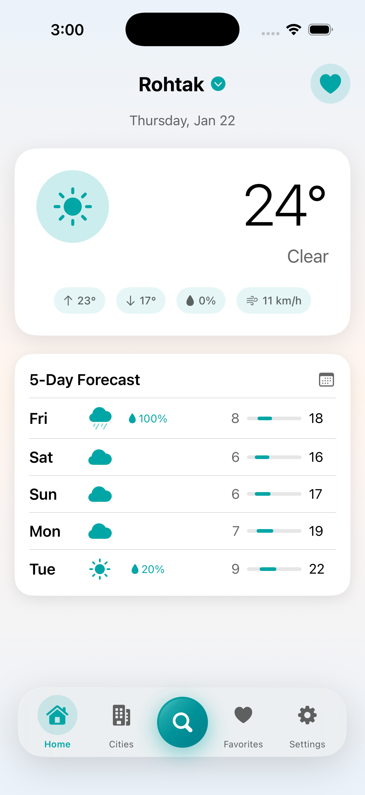
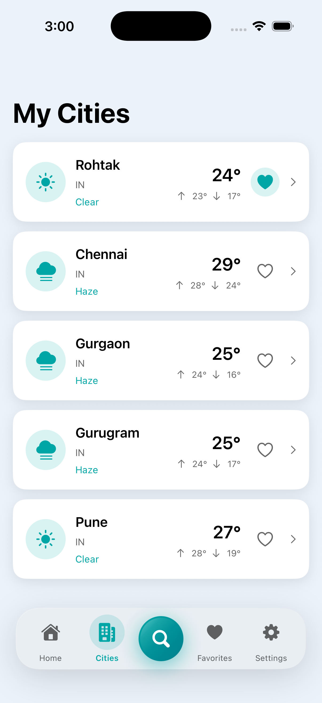
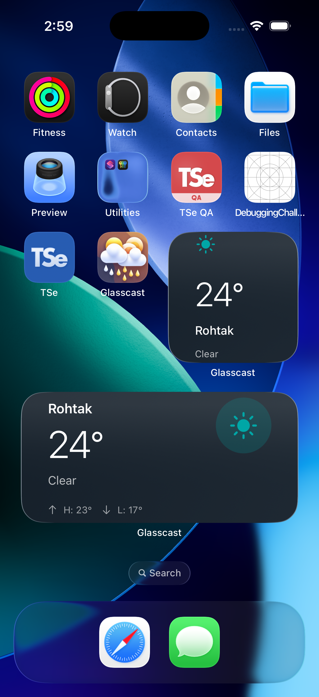

# Glasscast

A minimal weather app built with iOS 26's Liquid Glass design language.

**Assignment/Evaluation Project**

## Features

- **OTP Authentication** - Email-based magic link sign-in via Supabase
- **Weather Dashboard** - Current conditions + 5-day forecast with high/low temperatures
- **City Search** - Geocoding API integration with debounced search
- **My Cities** - Save cities from search, view weather for all saved cities
- **Favorites** - Mark cities as favorites for quick access
- **City Switcher** - Quick dropdown to switch between saved cities
- **Cloud Sync** - Real-time sync with Supabase
- **iOS 26 Glass Effects** - Liquid Glass UI design language
- **iOS Widgets** - Home screen widgets (small, medium, large sizes)
- **Dark/Light Mode** - Full support for system appearance

## Screenshots

### Authentication

| Login | OTP Verification |
|:---:|:---:|
|  |  |

### Dark Mode

| Home | My Cities | Favorites |
|:---:|:---:|:---:|
|  |  |  |

| City Detail | City Selector | Settings |
|:---:|:---:|:---:|
|  |  |  |

### Light Mode

| Home | My Cities |
|:---:|:---:|
|  |  |

### Widgets

| Home Screen Widgets |
|:---:|
|  |

## Tech Stack

- **UI Framework**: SwiftUI (iOS 26+)
- **Architecture**: MVVM + Clean Architecture
- **Backend**: Supabase (Auth + Database)
- **Weather API**: OpenWeatherMap
- **State Management**: `@Observable` macro, `@MainActor` isolation

## Setup Instructions

### Prerequisites

- Xcode 16+ with iOS 26 SDK
- macOS Sequoia or later
- Supabase account (free tier available)
- OpenWeatherMap API key (free tier available)

### Step 1: Clone the Repository

```bash
git clone <repository-url>
cd Glasscast
```

### Step 2: Configure API Keys

1. Copy the example config file:
   ```bash
   cp Config.xcconfig.example Config.xcconfig
   ```

2. Open `Config.xcconfig` and fill in your credentials:
   ```
   SUPABASE_URL = https://your-project-id.supabase.co
   SUPABASE_ANON_KEY = your_anon_key_here
   OPENWEATHERMAP_API_KEY = your_api_key_here
   ```

### Step 3: Supabase Database Setup

1. Create a new project at [supabase.com](https://supabase.com)
2. Go to **SQL Editor** in your Supabase dashboard
3. Run the following SQL to create the required table:

```sql
CREATE TABLE favorite_cities (
  id UUID DEFAULT gen_random_uuid() PRIMARY KEY,
  user_id UUID REFERENCES auth.users(id) ON DELETE CASCADE NOT NULL,
  city_name TEXT NOT NULL,
  country TEXT,
  lat DECIMAL(10, 7) NOT NULL,
  lon DECIMAL(10, 7) NOT NULL,
  is_favorite BOOLEAN DEFAULT FALSE NOT NULL,
  created_at TIMESTAMP WITH TIME ZONE DEFAULT NOW()
);

ALTER TABLE favorite_cities ENABLE ROW LEVEL SECURITY;

CREATE POLICY "Users can view own cities" ON favorite_cities
  FOR SELECT USING (auth.uid() = user_id);

CREATE POLICY "Users can insert own cities" ON favorite_cities
  FOR INSERT WITH CHECK (auth.uid() = user_id);

CREATE POLICY "Users can update own cities" ON favorite_cities
  FOR UPDATE USING (auth.uid() = user_id);

CREATE POLICY "Users can delete own cities" ON favorite_cities
  FOR DELETE USING (auth.uid() = user_id);

CREATE INDEX idx_favorite_cities_user_id ON favorite_cities(user_id);
CREATE INDEX idx_favorite_cities_is_favorite ON favorite_cities(is_favorite);
```

### Step 4: OpenWeatherMap API Key

1. Sign up at [openweathermap.org](https://openweathermap.org/api)
2. Generate an API key (free tier includes 1,000 calls/day)
3. Add the key to your `Config.xcconfig`

### Step 5: Build and Run

1. Open `Glasscast.xcodeproj` in Xcode
2. Wait for Swift Package Manager to fetch dependencies (Supabase SDK)
3. Select your target device or simulator (iOS 26+)
4. Press `Cmd + R` to build and run

### Troubleshooting

- **Build errors**: Ensure you're using Xcode 16+ with iOS 26 SDK
- **Auth not working**: Verify your Supabase URL and anon key are correct
- **Weather not loading**: Check your OpenWeatherMap API key and ensure it's activated
- **Database errors**: Make sure you've run the SQL schema and RLS policies are enabled

## Project Structure

```
Glasscast/
├── App/                    # App entry point
├── Core/                   # Config, Extensions, Theme, Network
├── Features/               # Auth, Home, Search, Cities, Favorites, Settings
├── Models/                 # Weather, City, FavoriteCity
├── Services/               # Auth, Weather, Favorites services
└── GlasscastWidgets/       # iOS Widget Extension
```

## License

© 2026 Jatin Singhroha. All Rights Reserved.

This project is submitted as an assignment/evaluation project.

### PERMITTED

- Viewing the source code for evaluation purposes only

### PROHIBITED

- Commercial use of any kind
- Modification or creation of derivative works
- Distribution or redistribution
- Use in other projects
- Any use beyond evaluation

This code is proprietary and confidential. Unauthorized use, copying, or distribution is strictly prohibited.
